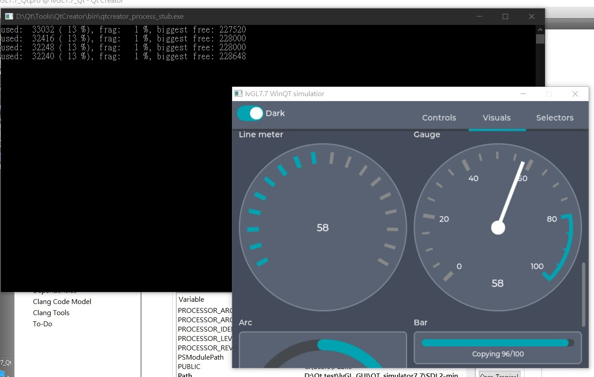
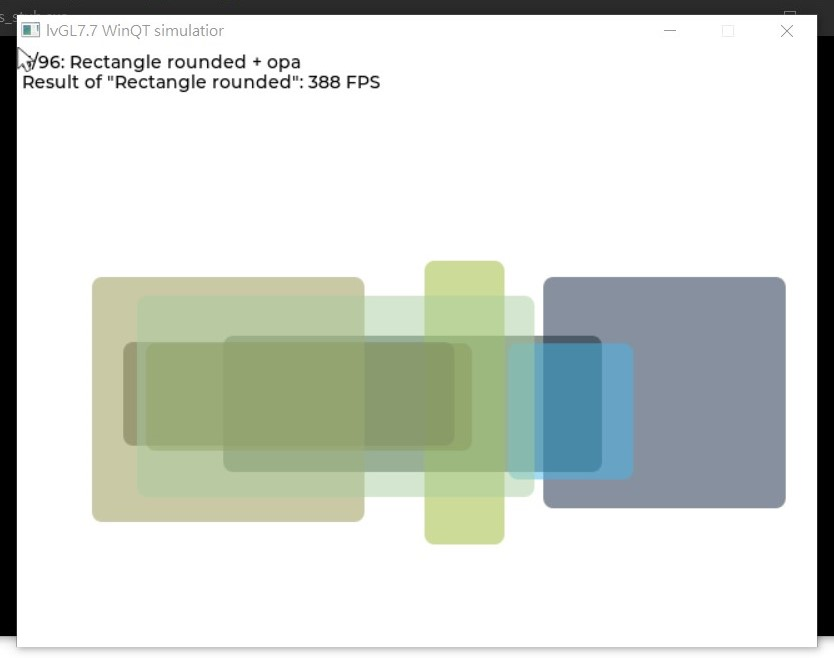
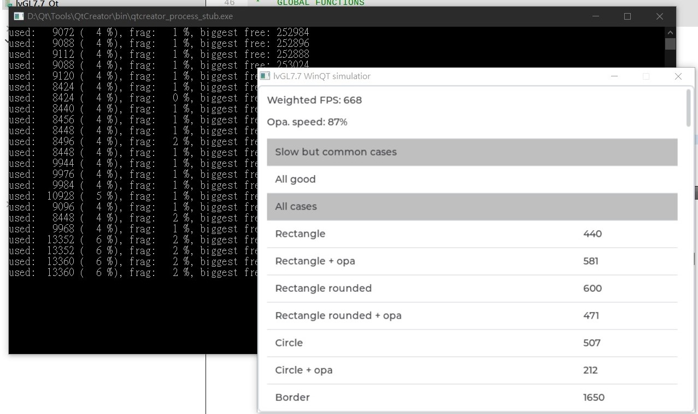
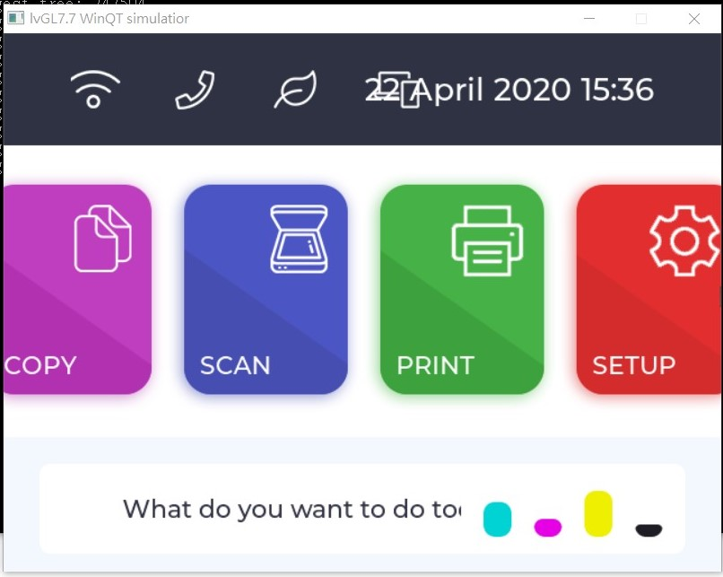
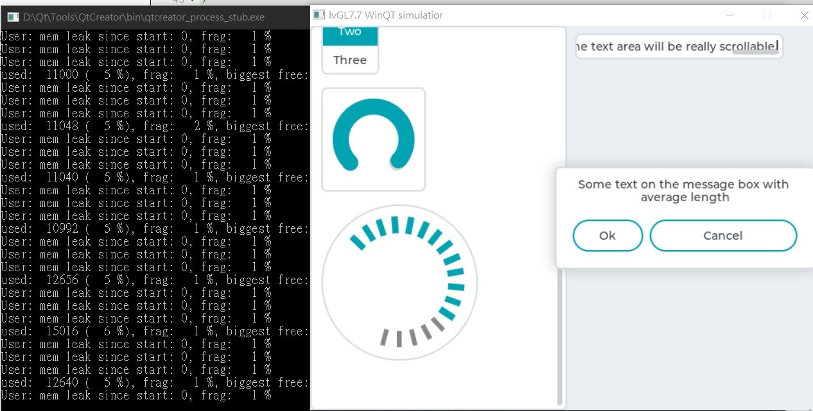

# lvGL_GUI  
lvGL7.7 GUI stuff, build and run on Windows10(mingw64) && MAC OSX 

## lvGL GUI simulator for MAC OSX  
remember to update DYLD_LIBRARY_PATH with SDL2 lib,bin for running app... 
 &nbsp;&nbsp;&nbsp;  
 &nbsp;&nbsp;&nbsp;  

## lvGL GUI simulator for Window10 (Mingw64)  
remember to update PATH with SDL2 lib,bin for running app... 
 &nbsp;&nbsp;&nbsp;  
 &nbsp;&nbsp;&nbsp;  
 &nbsp;&nbsp;&nbsp;   

## lvGL GUI for Wio Terminal (ATSAMD51P19 )  
use TFT_eSPI LCD driver... 
 &nbsp;&nbsp;&nbsp;  

## References
  - [libSDL](https://www.libsdl.org/) Simple DirectMedia Layer.
  - [lvGL](https://github.com/lvgl/lvgl)  Light and Versatile Graphics Library.
  - [lvGL.io](https://lvgl.io/developers) lvGL Getting Startted.
  - [lvGL WioTerminal](https://wiki.seeedstudio.com/Wio-Terminal-LVGL/) lvGL on Wio Terminal.
